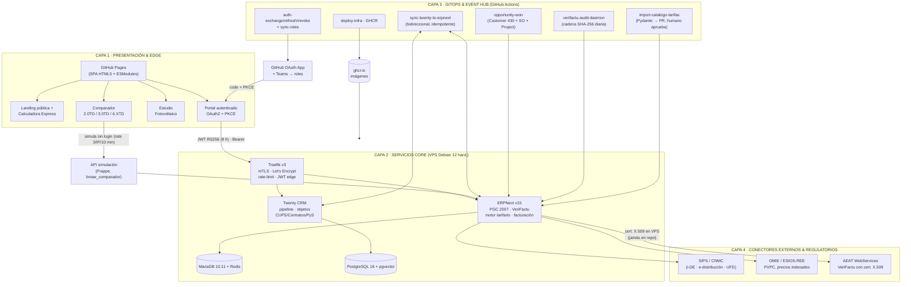
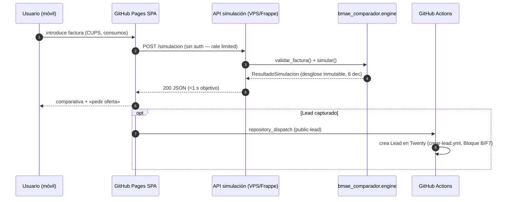
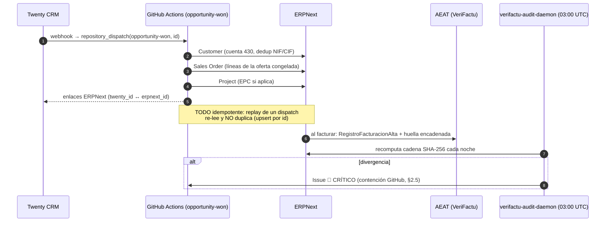

# A1 · Arquitectura de Alto Nivel — Plataforma Corporativa BMAE

**Ecosistema**: ERPNext v15+ · Twenty CRM · SPA Call-Flow-Business-BMAE
**Principio rector**: GitHub-First — nada sale del repositorio ni del
ecosistema GitHub salvo el VPS que aloja ERPNext/Twenty (única excepción
técnica permitida, justificada en §2 del Prompt Maestro).

## 1 · Mapa de 4 capas (vista lógica)

## 2 · Secuencia — comparación de oferta pública (sin login)

## 3 · Secuencia — oportunidad ganada → ERPNext facturable

## 4 · Decisiones de diseño del Bloque A (documentación exigida)

| # | Decisión | Alternativa / mitigación |
| :--- | :--- | :--- |
| D-1 | **DiasAno** del TP se toma del año de **fecha_fin** de factura (cuota de potencia devengada por días naturales del periodo de cobro). | Facturas a caballo de año usan el año del devengo — regla sectorial estándar; documentar en la propia factura (ya va en `detalle` de cada línea). |
| D-2 | **Financiación bono social SUMA** a «Otros» (la repercute el comercializador en precio); desactivable por factura (`financia_bono_social=false`). | Si la CNMC publica orden distinta, se cambia la constante anual — jamás el código (parametrización, §5.2). |
| D-3 | Método de excesos cuartohorarios **`suma_raices`** (fórmula literal §5.1.3 del Prompt Maestro: `Σ_i√(P_i−Pc)²`). | La variante BOE `raiz_suma` está parametrizada en `ExcesosPotencia.metodo_cuartohorario`; el estudio regulatorio F0/F3 elige y sólo editando constantes. **ALTERNATIVA PRAGMÁTICA** señalada al equipo legal. |
| D-4 | Hash VeriFactu con **serializado `Campo=Valor&…` de la AEAT** (nombres de campo del schema oficial) en HEX mayúsculas. | §6.2 del maestro confirma campos; el formato exacto AEAT permite contrastar con el XSD sin traducciones propias. Validado en tests contra la fórmula literal. |
| D-5 | **Doble implementación** del motor: oráculo plano en `tools/generar_fixtures.py` fija 50 facturas; el engine se contrasta contra el JSON (tolerancia exigida 0,01 €, real: igualdad a 2 dec). | Regresión dura: un refactor que mueva ≥0,01 € rompe 50 tests simultáneos. |
| D-6 | Publicación del catálogo tarifario **solo por PR humano** (A5.4). | La última barrera regulatoria es una persona firmando números, no un bot. GitHub-First se respeta (el PR vive en el propio repo). |
| D-7 | DLQ unificado como **Issues privados etiquetados `dlq`** + artefactos con retención (30/90/400 d según sensibilidad). | Nada sale de GitHub; la retención larga fiscal (≈7 a) se consolida en Releases anuales (verificación A5.3). |

## 5 · Contención GitHub-First (verificación A)

- Los 4 workflows (A5) escriben **Issues, PRs, artefactos y Releases**:
  cero destinos externos (salvo APIs de negocio de ERPNext/Twenty, VPS
  justificado §3).
- Secretos exclusivamente GitHub (Environment Secrets, rotación 90 d).
- Imágenes en GHCR; despliegue por SSH desde GitHub Actions (deploy-infra
  se sella en Bloque B/E).
- El certificado X.509 de AEAT vive SOLO en el VPS (cifrado en disco),
  nunca en el repo ni en artefactos.

## 6 · Estado de los entregables del Bloque A

| # | Entregable | Ruta | Estado |
| :-- | :--- | :--- | :--- |
| A1 | Este documento (arquitectura Mermaid) | `bmae-plataforma/docs/arquitectura.md` | ✅ completo |
| A2 | Objetos Twenty (Metadata SDK, TS strict) | `bmae-plataforma/twenty-sdk/src/` | ✅ tsc --noEmit 0 errores |
| A3 | Motor Python `bmae_comparador.engine` | `bmae-plataforma/motor/src/bmae_comparador/` | ✅ 62/62 pytest |
| A4 | Módulo VeriFactu ERPNext | `bmae-plataforma/verifactu/bmae_verifactu/` | ✅ 7/7 pytest |
| A5 | Workflows de sincronización | `bmae-plataforma/.github/workflows/` | ✅ 4/4 YAML válidos |
| A6 | Suite pytest 50 facturas | `bmae-plataforma/motor/tests/` | ✅ 50/50 + 12 reglas |

**Siguiente bloque (B — autenticación PKCE/JWT RS256): pedir con
«continúa Bloque B».**
